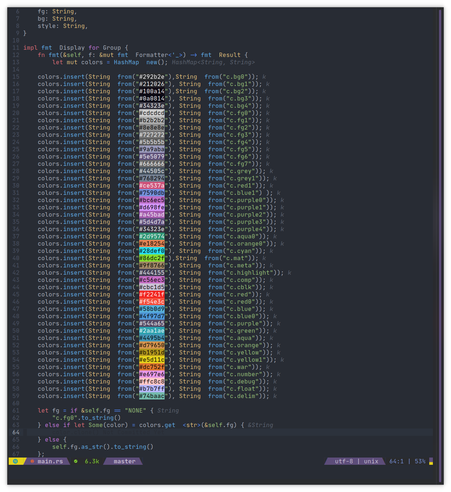
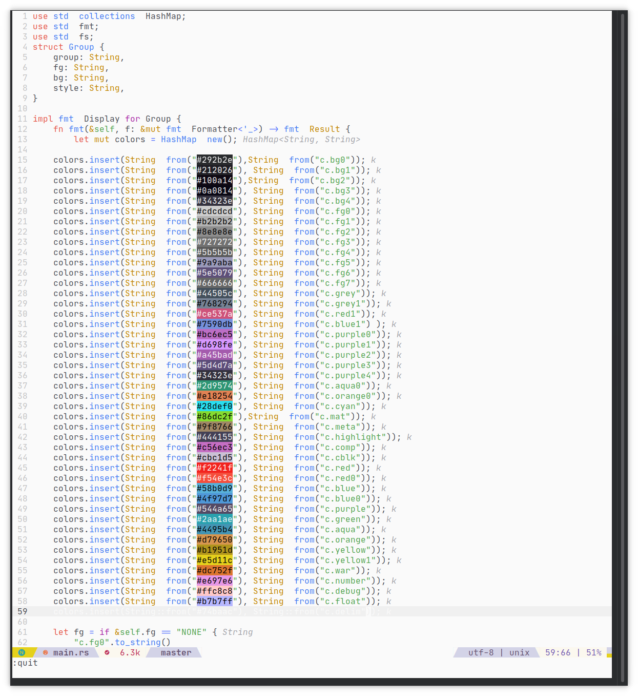

# Onebuddy

An atom one inspired dark and light colorscheme using [tjdevries/colorbuddy.vim](https://github.com/tjdevries/colorbuddy.vim)

This plugin is also an example of how easy it is to customize and make new colorschemes based on `colorbuddy`.

Check out [`lua/onebuddy.lua`](lua/onebuddy.lua)

## Screenshots

Dark theme



Light theme



*Font:* Jet Brains Mono
*Statusline:* [Spaceline](https://github.com/glepnir/spaceline.vim)
*RGB Highlightin:* [nvim-colorizer.](https://github.com/norcalli/nvim-colorizer.lua)

### Getting Started

You have to make sure you install [tjdevries/colorbuddy.vim](https://github.com/tjdevries/colorbuddy.vim) Only termguicolors are supported and that will not change.

#### Vim Plug

```vim
Plug 'tjdevries/colorbuddy.vim'
Plug 'Th3Whit3Wolf/onebuddy'

" And then somewhere in your init.vim, to set the colorscheme
lua require('colorbuddy').colorscheme('onebuddy')
```

#### Minpac

```vim
call minpac#add('tjdevries/colorbuddy.vim')
call minpac#add('Th3Whit3Wolf/onebuddy')

" And then somewhere in your init.vim, to set the colorscheme
lua require('colorbuddy').colorscheme('onebuddy')
```

#### Vim Packages

In the terminal execute this command.

```sh
cd ~/.local/share/nvim/site/pack/opt/
git clone https://github.com/tjdevries/colorbuddy.nvim
git clone https://github.com/Th3Whit3Wolf/onebuddy
```

In your `init.vim` add the following

```vim
packadd! colorbuddy
packadd! onebuddy
```

and then

```vim
lua require('colorbuddy').colorscheme('onebuddy')
```

or

```vim
colorscheme onebuddy
```

### NOTE

- Vim is not supported because the theme is written in lua.
- If you feel like a language should be highlighted differently please open an issue.

### TODO

- [ ] Better LSP Highlighting
- [ ] Better Diagnostic Highlighting
- [x] Better Tree Sitter Highlighting
